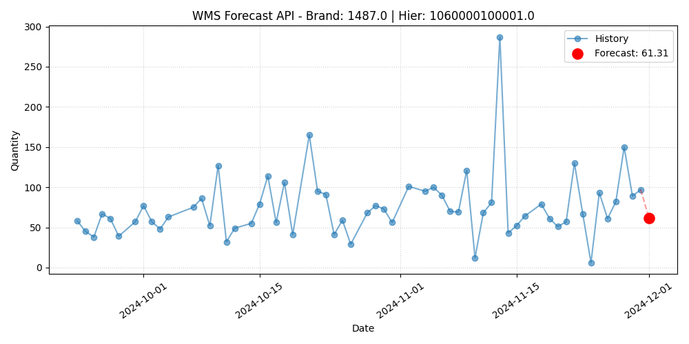

# Warehouse Management System Product Forecast


A production-grade research project for **Time Series Forecasting in Warehouse Management System (WMS)** using **AI-based approaches**.


This project is a structured **MLOps pipeline**, featuring:
- **Models**: XGBoost (Gradient Boosting) and LSTM (Deep Learning).
- **MLOps**: Experiment tracking with MLflow and data versioning with DVC. Fully containerized in Docker.
- **Engineering**: Modular code, automated feature engineering, and Unit Testing.
- **CI/CD Ready**: Makefile automation for setup, training, and evaluation.

## 🚀 Features
- **Dockerized Environment**: Fully isolated development environment ensuring consistency across machines.
- **Multi-Model Architecture**: Supports XGBoost (Regression) and LSTM (Multi-step forecasting).
- **Resumable Training**: Ability to pause and resume training from checkpoints for both models.
- **Automated Feature Engineering**: Generation of Lags, Differences, EWMAs, Cyclical Temporal features, weekend/holidays and Black Friday indicators and payday zone interval.
- **Robust Evaluation**: Detailed metrics (MAE, RMSE, MAPE).
- **Visualizations**: Automated generation of forecast plots and validation curves. 

## 📂 Project Structure
```
├── .dvc/                  # DVC Configuration
├── data/                  # Data managed by DVC
├── models/                # Saved models and checkpoints            
├── src/
│   ├──  training/         # Training pipelines
│   ├──  eval/             # Evaluation logic
│   ├──  utils/            # Helper modules
│   ├──  runs/             # Visualization plots
│   ├──  api.py            # FastAPI Production Server
│   └──  main.py           # CLI Entry point
├── tests/                 # Unit tests
├── docker-compose.yml     # Docker services configuration
├── Dockerfile             # Docker image definition
├── Makefile               # Command automation
├── requirements.txt       # Python dependencies
├── README.md              # Project documentation
```

## 🛠️ Setup & Requirements

This project uses `make` for automation and `dvc` for data management.

1. **Clone the repository**:
```bash
git clone https://github.com/alvaro-frank/wms-forecast.git
cd wms-forecast
```

2. **Setup Environment**: This command creates a virtual environment, installs dependencies, and pulls data via DVC.
```bash
make setup
```

## ⚡ Quick Start

To run the **full end-to-end pipeline** (Clean -> Setup -> Unit Tests -> Train -> Evaluate -> Visual Test) in one go:
```bash
make all
```

## 🏃 Usage

You can run all pipelines via the CLI (`src/main.py`) or using the `Makefile` shortcuts.

1. **Training**
Train a model (XGBoost or LSTM). Artifacts and metrics are logged to **MLflow**.

| Arg        | Purpose                                   | Default | Examples |
|------------|-------------------------------------------|---------|----------|
| `MODEL`    | Model architecture to train (`xgboost` or `lstm`)     | `xgboost`   | `MODEL=lstm` |
| `ARGS` | Additional hyperparameters passed to script               | `''`   | `ARGS='--epochs 50 --batch_size 64'` |
| `RESUME`     | Resume training from existing checkpoint                              | `False`    | `RESUME=True` |

**Standard Training**:
```bash
# Train XGBoost (Default)
make train MODEL=xgboost

# Train LSTM with args
make train MODEL=lstm ARGS='--epochs 20 --batch_size 64'
```

**Resume Training**: If a training run was interrupted or you want to improve an existing model.
```bash
make train MODEL=xgboost RESUME=True
```

2. **Evaluation**

Evaluate trained models against the test set. Calculates metrics like MAE and RMSE.

| Arg        | Purpose                                   | Default | Examples |
|------------|-------------------------------------------|---------|----------|
| `MODEL`    | Model to evaluate (`xgboost` or `lstm`)     | `xgboost`   | `MODEL=lstm` |
| `BRAND` | Filter evaluation for a specific Brand ID               | `None` (All brands)   | `BRAND=1791.0` |

```bash
# Evaluate XGBoost
make evaluate MODEL=xgboost

# Evaluate for a specific Brand
make evaluate MODEL=lstm BRAND='1791.0'
```

3. **Visualization**

Generate forecast plots for visual inspection of specific hierarchies.

| Arg        | Purpose                                   | Default | Examples |
|------------|-------------------------------------------|---------|----------|
| `MODEL`    | Model predictions to visualize (`xgboost` or `lstm`)     | `xgboost`   | `MODEL=lstm` |
| `BRAND` **(Required)** | Brand ID               | `1791.0`   | `BRAND=1791.0` |
| `HIER` **(Required)** | Product Hierarchy ID               | `1090000600002.0`   | `HIER=1090000600002.0` |

```bash
# Visual Test (Generates .png in runs/)
make test MODEL=xgboost HIER='1090000600002.0' BRAND='1791.0'
```

4. **Unit & Integration Testing**

Ensure feature engineering and filtering logic are working correctly.
```bash
make unit-test
```

5. **Experiment Tracking**

```bash
# Dashboard will be available at http://localhost:5000
make mlflow
```

## 🧠 Methodology

The project forecasts **future daily quantities** using a lookback window approach.

**Key Features**:
- **Calendar**: Weekday, Month, Year, Holiday flags (Portuguese Calendar).
- **Cyclical**: Sine/Cosine encoding for Week/Month/Year continuity.
- **Lags**: 1, 2, 7, 15, 30 days.
- **Trends**: Exponential Moving Averages (EWMA) with spans of 5, 20, 50.
- **Events**: 'Black Friday Week', 'Pre-Christmas', 'Payday Zone'.

**Preprocessing**:
1. **Filtering**: Keeps only top N Brands/Hierarchies by volume.
2. **Imputation**: Handled via sklearn Pipelines (SimpleImputer).
3. **Scaling**: MinMaxScaler for LSTM inputs; Log1p transformation for Targets.

## 🐳 Docker Support

This project is fully containerized to ensure environment consistency and simplify the execution of the machine learning pipelines (XGBoost and LSTM).

**Prerequisites**
- **Docker** and **Docker Compose** installed.
- **NVIDIA Container Toolkit** (Optional: only if you intend to map a physical GPU to the container).

**How to Run**
1. **Build and Start**: Build the image and start the default service defined in `docker-compose.yml`.
```bash
docker compose up -d --build
```

2. **Pull Data**: Download the dataset and model artifacts using DVC inside the container.
```bash
docker compose run --rm wms-app dvc pull
```

3. **Train Models**: Run the training pipeline for XGBoost or LSTM.
- **XGBoost**
```bash
docker compose run --rm wms-app python src/main.py train --model xgboost --n_estimators 1000 --learning_rate 0.1
```

- **LSTM**
```bash
docker compose run --rm wms-app python src/main.py train --model lstm --epochs 20 --batch_size 64
```

4. **Evaluate Performance**: Calculate metrics (MAE, RMSE, SMAPE) for the test set.
```bash
docker compose run --rm wms-app python src/main.py evaluate --model xgboost
```

5. **Visual Forecasting**: Generate forecast plots for a specific hierarchy and brand.
```bash
docker compose run --rm wms-app python src/main.py test --model lstm --hierarchy '1060000100001.0' --brand '1487.0'
```

6. **Unit & Integration Testing**: Ensure feature engineering logic is valid.
```bash
docker compose run --rm wms-app pytest tests/
```

7. **Interactive Shell**: Access the container's terminal for debugging.
```bash
docker compose run --rm --entrypoint bash wms-app
```
## 🔌 API Usage

The project exposes a REST API via FastAPI.



**Start the API**:
```bash
docker-compose up --build
```

**Make a Prediction**:
```bash
curl -X POST "http://localhost:8002/predict" \
     -H "Content-Type: application/json" \
     -d '{
          "brand": "1487.0",
          "hierarchy": "1060000100001.0",
          "date": "2024-12-01"
         }'
```

**Response**:
```bash
{
  "brand":"1487.0",
  "hierarchy":"1060000100001.0",
  "forecast_date":"2024-12-01",
  "predicted_quantity":61.31,
  "plot_path":"runs/api_forecast_1487.0_1060000100001.0.png"
}
```
## ⚙️ CI/CD Pipeline

This project implements a Continuous Integration pipeline via GitHub Actions to ensure code and model integrity on every push or pull request to the `main` or `master` branches.

**Pipeline Workflow**:
1. **Isolated Environment**: Sets up a Python 3.10 environment and installs all dependencies listed in `requirements.txt`.
2. **Data & Model Synchronizaton**: Authenticates with DagsHub using GitHub Secrets and executes `dvc pull` to download the models and datasets required for testing.
3. **Database**: Runs the `src/utils/prepare_api_db.py` script to generate the SQLite inference database within the runner.
4. **Automated Testing**: Executes the full test suite via `pytest`, covering:
     - **Unit Tests**: Validating feature engineering logic and data filtering.
     - **Integration Tests**: Verifying the reliability of the FastAPI endpoints.

**Required GitHub Secrets**

To enable the pipeline in your own fork, you must add the following secrets in your repository settings:
- **`DAGSHUB_USERNAME`**: Your DagsHub username.
- **`DAGSHUB_TOKEN`**: Your DagsHub access token.
