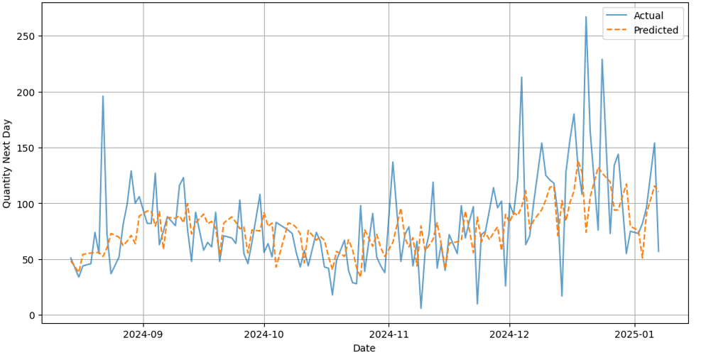

# Warehouse Management System Product Forecast

A production-grade research project for **Time Series Forecasting in Warehouse Management System (WMS)** using **AI-based approaches**.



This project is a structured **MLOps pipeline**, featuring:
- **Models**: XGBoost (Gradient Boosting) and LSTM (Deep Learning).
- **MLOps**: Experiment tracking with MLflow and data versioning with DVC.
- **Engineering**: Modular code, automated feature engineering, and Unit Testing.
- **CI/CD Ready**: Makefile automation for setup, training, and evaluation.

## 🚀 Features
- **Multi-Model Architecture**: Supports XGBoost (Regression) and LSTM (Multi-step forecasting).
- **Resumable Training**: Ability to pause and resume training from checkpoints for both models.
- **Automated Feature Engineering**: Generation of Lags, Differences, EWMAs, Cyclical Temporal features, weekend/holidays and Black Friday indicators and payday zone interval.
- **Robust Evaluation**: Detailed metrics (MAE, RMSE, MAPE).
- **Visualizations**: Automated generation of forecast plots and validation curves. 

## 📂 Project Structure
```
├── .dvc/                  # DVC Configuration
├── data/                  # Data managed by DVC
├── models/                # Saved models and checkpoints            
├── src/
│   ├──  training/         # Training pipelines
│   ├──  eval/             # Evaluation logic
│   ├──  utils/            # Helper modules
│   ├──  runs/             # Visualization plots
│   └──  main.py           # CLI Entry point
├── tests/                 # Unit tests
├── Makefile               # Command automation
├── requirements.txt       # Python dependencies
├── README.md              # Project documentation
```

## 🛠️ Setup & Requirements

This project uses `make` for automation and `dvc` for data management.

1. **Clone the repository**:
```bash
git clone https://github.com/alvaro-frank/wms-forecast.git
cd wms-forecast
```

2. **Setup Environment**: This command creates a virtual environment, installs dependencies, and pulls data via DVC.
```bash
make setup
```

## ⚡ Quick Start

To run the **full end-to-end pipeline** (Clean -> Setup -> Unit Tests -> Train -> Evaluate -> Visual Test) in one go:
```bash
make all
```

## 🏃 Usage

You can run all pipelines via the CLI (`src/main.py`) or using the `Makefile` shortcuts.

1. **Training**
Train a model (XGBoost or LSTM). Artifacts and metrics are logged to **MLflow**.

**Standard Training**:
```bash
# Train XGBoost (Default)
make train MODEL=xgboost

# Train LSTM with args
make train MODEL=lstm ARGS="--epochs 20 --batch_size 64"
```

**Resume Training**: If a training run was interrupted or you want to improve an existing model.
```bash
make train MODEL=xgboost RESUME=True
```

2. **Evaluation**

Evaluate trained models against the test set. Calculates metrics like MAE and RMSE.
```bash
# Evaluate XGBoost
make evaluate MODEL=xgboost

# Evaluate for a specific Brand
make evaluate MODEL=lstm BRAND="1791.0"
```

3. **Visualization**

Generate forecast plots for visual inspection of specific hierarchies.
```bash
# Visual Test (Generates .png in runs/)
make test MODEL=xgboost HIER="1090000600002.0" BRAND="1791.0"
```

4. **Unit Testing**

Ensure feature engineering and filtering logic are working correctly.
```bash
make unit-test
```

5. **Experiment Tracking**

```bash
# Dashboard will be available at http://localhost:5000
make mlflow
```

## 🧠 Methodology

The project forecasts **future daily quantities** using a lookback window approach.

**Key Features**:
- **Calendar**: Weekday, Month, Year, Holiday flags (Portuguese Calendar).
- **Cyclical**: Sine/Cosine encoding for Week/Month/Year continuity.
- **Lags**: 1, 2, 7, 15, 30 days.
- **Trends**: Exponential Moving Averages (EWMA) with spans of 5, 20, 50.
- **Events**: "Black Friday Week", "Pre-Christmas", "Payday Zone".

**Preprocessing**:
1. **Filtering**: Keeps only top N Brands/Hierarchies by volume.
2. **Imputation**: Handled via sklearn Pipelines (SimpleImputer).
3. **Scaling**: MinMaxScaler for LSTM inputs; Log1p transformation for Targets.

## ⚙️ Configuration

Key parameters can be adjusted in the code or via CLI arguments:
- **Feature Logic**: src/utils/features.py
- **XGBoost Hyperparams**: src/training/train_xgboost.py
- **LSTM Architecture**: src/training/train_lstm.py
- **CLI Arguments**: src/main.py
